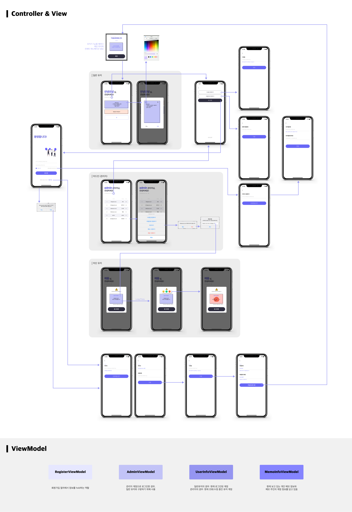

# Authorization System
   
</br>

## 💬 About Project
Node.js로 서버를 구축하고 Amazon RDS로 MySQL을 운영하고 있는 iOS 앱입니다.<br/>
인증 시스템을 주요하게 다루되, 앱단에서 보여줄 수 있는 요소들을 자유롭개 추가하였습니다.
<br/>
<br/>

## 📱 ScreenShots
<Blockquote>
실제 앱 구동화면입니다
</Blockquote>

|  |  |  |  |
| :-: | :-: | :-: | :-: |
| 회원가입 페이지 | 일반유저 로그인 | 관리자 로그인 | 자동 로그인 |
|  |  |  |  |
| 차단유저 로그인  | 개인 메모 작성 | 개인정보 수정 | 탭제스처 인식 |
<br/>

## 🏃‍♀️ Installation
> 테스트 run을 위해서 해당 정보가 필요하신 경우 말씀해주시면 제공해드리겠습니다.
1. Server 폴더에 아래 사항들을 포함한 `.env` 파일을 추가해주세요.
```
PORT=3306
dbHost='database-1.clcnthr2is4n.ap-northeast-2.rds.amazonaws.com'
dbUser='admin'
dbPassword='admin123'
dbName='PersonalProject'
emailId='sgssgmanager@gmail.com'
emailPw='streamingsgs!'
jwtSecret='Kn8tO1Q4zPpw9vFUsatjPKb8mGuo8H/uM/9nGOMmKQjXG+ZGbK1Tuk/FuLULr+WJ6VeAAXI3GruLi6S+'
```
2. Server 폴더로 이동하신 후 필요한 모듈을 설치해주세요. 필요한 모듈을 포함한 코드는 아래와 같습니다.
```
npm install mysql express env-cmd bcryptjs jsonwebtoken nodemon dotenv --save
```
3. `npm start`를 실행하시면 서버를 시작하실 수 있습니다
<br/>

## 🌟 Features
###  1) 이메일 인증을 통한 회원가입
- SMTP를 사용하여 이메일 인증 구현

###  2) 보다 안전한 토큰 기반 인증
- Refresh Token과 AccessToken를 둘다 이용하여서 보안 강화

###  3) 자동로그인
- SwiftKeychainWrapper와 UserDefaults를 사용해서 자동로그인 구현

###  4) 애니메이션 요소
- Lottie와 CGAffineTransform를 이용하여서 디테일한 애니메이션 추가

###  5) User Interactive 요소 가미
- 유저의 long press와 tap 동작에 상호작용적으로 반응하는 UX 요소 추가
<br/>

## 🛠 Architecture
### 1) 전체 아키텍처
> 모놀리식 아키텍처를 사용하였습니다.


### 2) iOS 구조
> MVVM 패턴을 채택하였습니다. 화면 간 연결은 아래와 같이 구성되었습니다.


<br/>

## 🔥 Technical Achievements
### 서버 사이드
- 직접 RDBMS를 설계하고, SQL 쿼리문을 작성하였습니다.
- node.js로 서버를 구축하고 restAPI를 설계 및 구현하였습니다.
- 토큰을 이용한 인증 절차를 이해하고, access token과 refresh token을 도입하였습니다. access token은 2시간, refresh token은 14일 후 만료되도록 설정하였습니다.
- SMTP를 사용하여서 이메일 인증을 구현하였습니다.

### iOS 사이드
- refresh token과 access token을 관리하고, 서버와 통신하며 적절한 액션을 취하도록 구현하였습니다.
- 여러 계층에 거친 데이터 전달과 비동기 이벤트 핸들링을 위해서 Combine을 적극 사용하였습니다.
- SwiftKeychainWrapper와 UserDefaults, token을 적절히 활용하여 안전하게 자동로그인을 구현하였습니다.
- 회원가입을 진행하던 중 예상치 못하게 종료에 대응할 수 있도록 UserDefaults를 이용하였습니다.
- Lottie와 CGAffineTransform를 이용하여서 애니메이션적인 요소를 추가하여 앱의 완성도를 높였습니다.
- 유저의 제스처에 반응하여서 애니메이션의 위치가 바뀌거나, long press로 반응 이모지를 보내는 등 interactive한 재미 요소들을 추가하였습니다.
